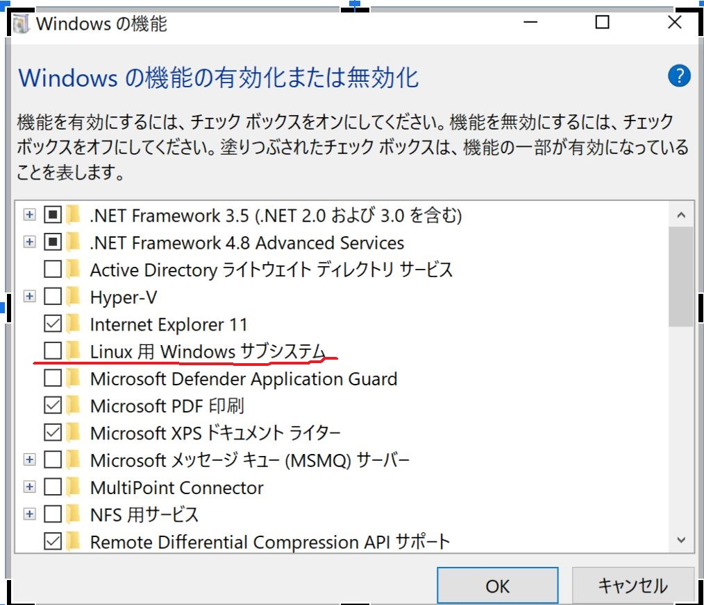
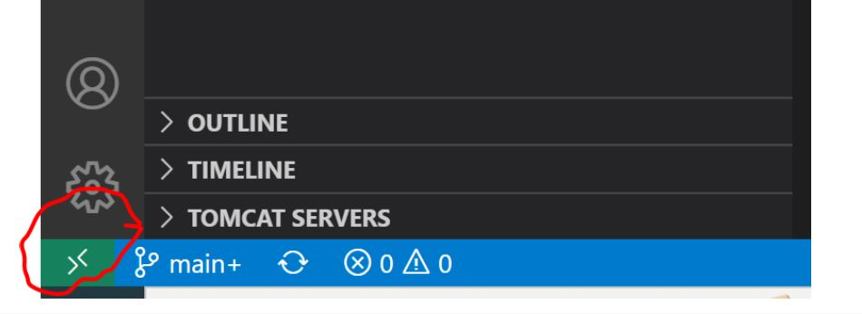
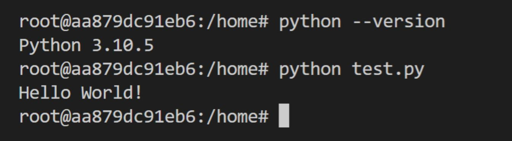
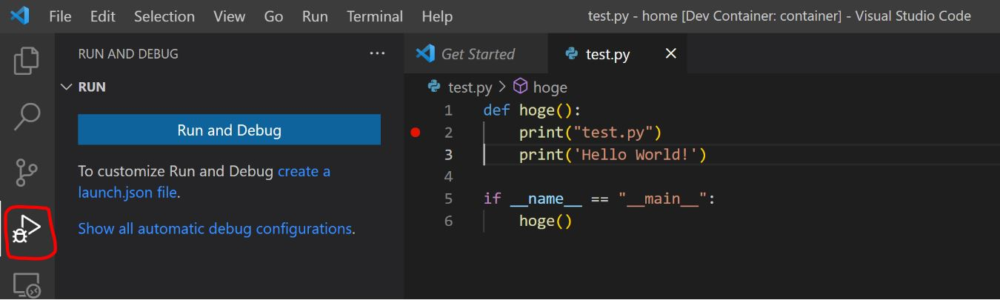
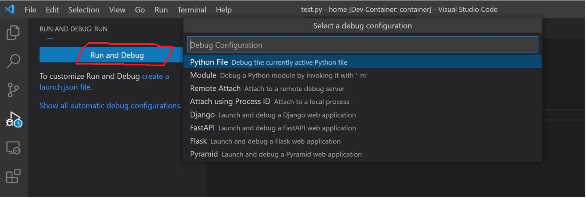
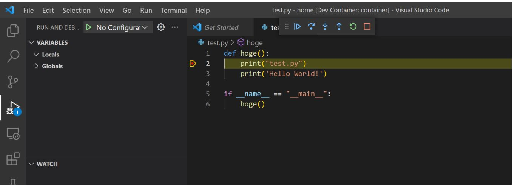

# Build a development environment using Docker Desktop.

## Advantages
1. Reduce the time it takes to build a development environment. 
2. Can ensure that they are in the same environment. 
3. No need to change the local environment.

## Disadvantage
1. Cost of learning about Docker. 
2. Requires a certain amount of machine power. 

## Goals for this time
Run and debug Python without installing a local Python environment. 

### Preparation of the environment
#### 1) Installing Windows Subsystem for Linux. 

-Check for situations where the "Windows Subsystem for Linux" is not enabled. 
 

1-1) Run PowerShell as an administrator and execute the following commands. 
wsl --install 
 
1-2) After Ubuntu starts, set a username and password. 
Note 1: If you run wsl --install and see WSL help text, run wsl --list --online to list available distributions, then run wsl --install -d DistroName to Install. 
Note 2: Passwords are not displayed. 
 
-Confirm that the "Windows Subsystem for Linux" is enabled. 

Execute the following command in PowerShell to check the version of wsl, and if VERSION is 1, execute 1-3) or later. 
wsl -l -v 
 
1-3) Download the Linux kernel update package. 
https://docs.microsoft.com/en-us/windows/wsl/install-manual#step-4---download-the-linux-kernel-update-package 
 
1-4) Run PowerShell as an administrator and execute the following commands. 
wsl --set-version distro_name 2 
Example.wsl --set-version Ubuntu 2 

Then check the version. 
  
 

#### 2) Install Windows Terminal (optional)
Refer to the following sites. 
https://docs.microsoft.com/en-us/windows/terminal/install 
 

#### 3) Deploy Docker desktop with WSL 2 
3-1) Download and run the installer from the following site. 
https://docs.docker.com/desktop/windows/wsl/ 
 
3-2) Make sure the two checkboxes are checked, click OK, and run the installation. 
 
 
3-3) If a task called Vmmem ever takes up a lot of memory, limit the memory by putting the following in C:\Users\[username]\.wslconfig. 
 
[wsl2] 
memory=1GB 
 
Then, run PowerShell as an administrator and reboot with the following command. 
Get-Service LxssManager | Restart-Service 
 

#### 4) Introducing Visual Studio Code 
Refer to the following sites. 
https://code.visualstudio.com/
 

#### 5) Introduction of Remote-Containers (Visual Studio Code extension) 
Search for Remote-Containers in the Extensions section for information on installing extensions. 
 

### Sample Summary Description
- Code Reference
https://dev.classmethod.jp/articles/vscode-container-connect/
- Link to sample created
https://github.com/ShugoYoko/docker_dev.git 
- Key points of docker-compose.yml 
volumes:
      - ./src:/home/:cached 
The src folder can be mounted to home in the Docker container to reflect changes in the source.
- Key points of .devcontainer/devcontainer.json 
 "extensions": [
      "ms-python.python"
  ] 
Extensions required for debugging are installed in containers.
 

### Verification method using samples 
#### 1) Start Docker Desktop 

#### 2) If git is installed, run the following command. 
git clone https://github.com/ShugoYoko/docker_dev.git 

#### 3) Open docker_dev folder in Visual studio code 

#### 4) Reopen in Container to start container. 
Initially, it takes time to create the container.
 

#### 5) Open New Terminal from Visual Studio Code Terminal and execute the command to confirm that Python is installed and test.py can be executed.

 

#### 6) Debugging can be performed by setting breakpoints.

 

 

 

 

Select "Reopen Folder Locally" to return.
 

## Summary
This method is also effective when it is necessary to prepare a database or to develop a web application that includes a database. I would like to continue to examine various types in the future. 

