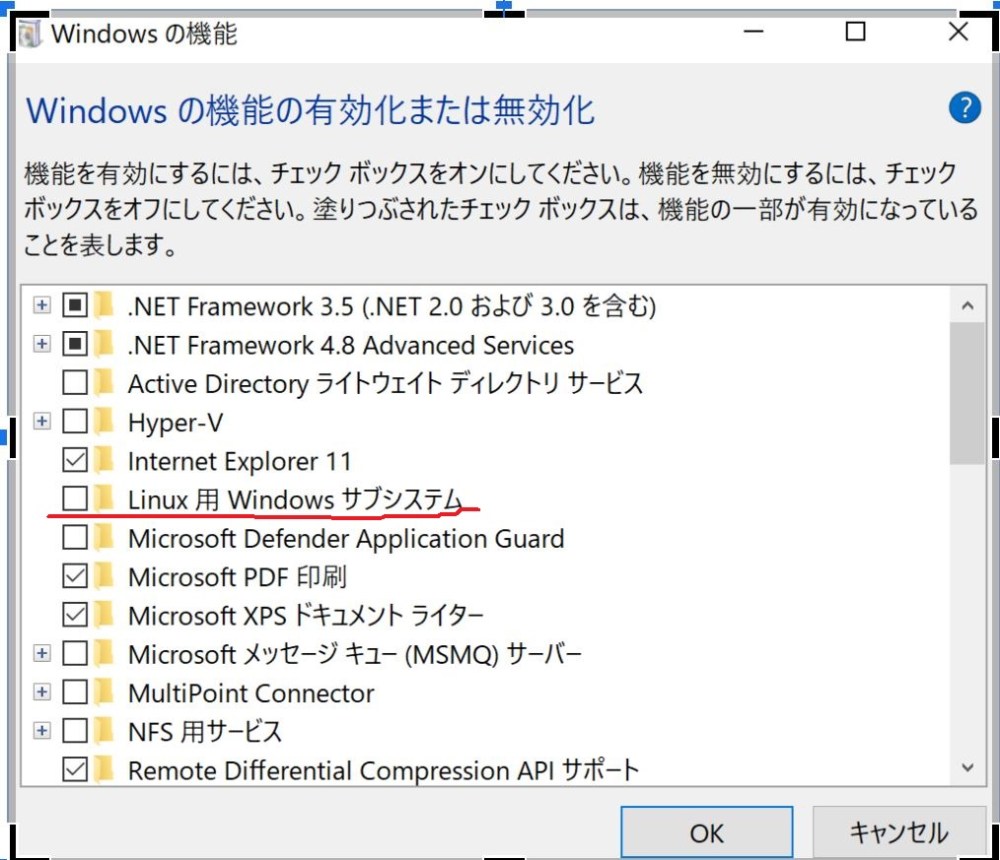
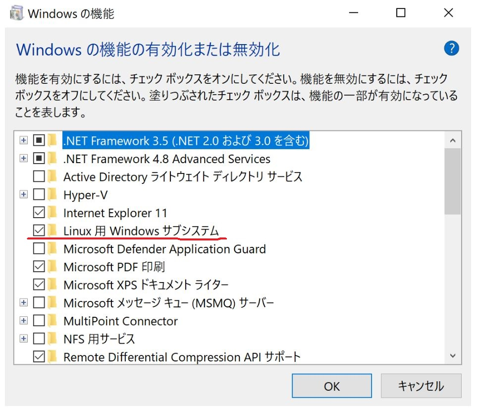
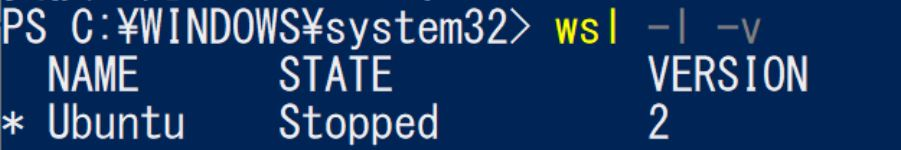
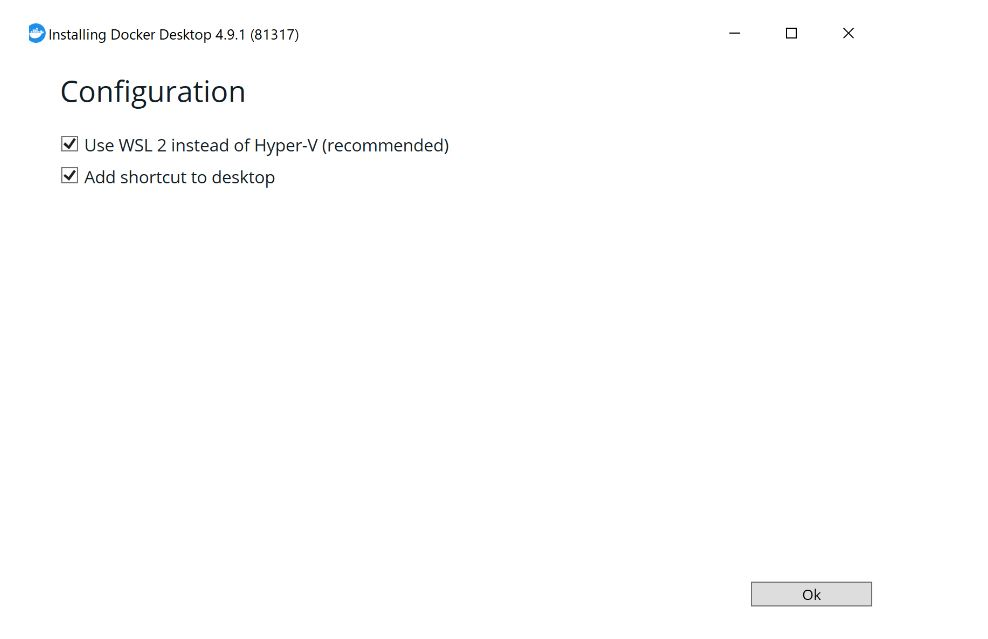
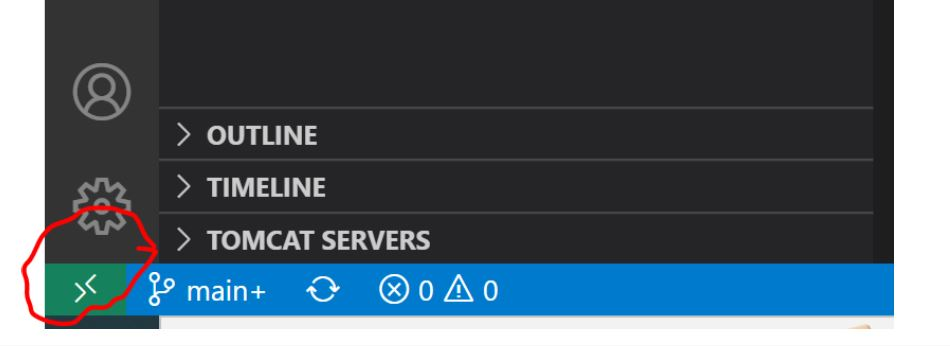
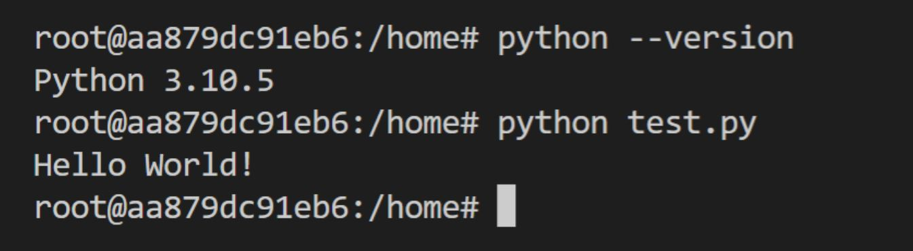
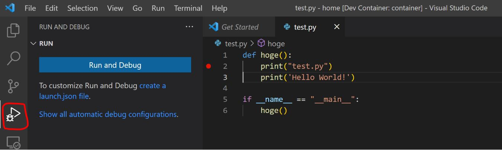
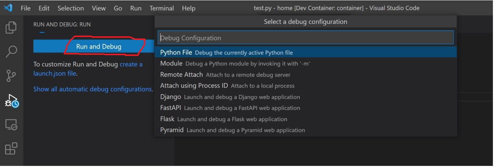
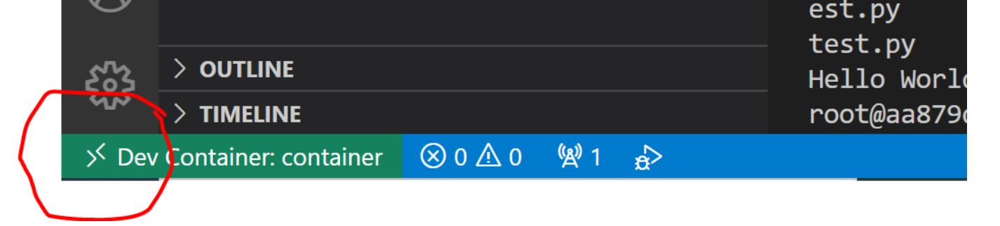

# Docker Desktop を使用して開発環境を構築する

## メリット
1. 開発環境を構築する時間を短縮する 
2. 同じ環境であることを確保できる 
3. ローカル環境を汚さずに済む

## デメリット
1. Dockerに関する学習コスト 
2. ある程度のマシンパワーが必要 

## 今回の目標
Python の環境をローカルに導入することなく、実行、及びデバックを行う。 

### 環境準備
#### 1) Windows Subsystem for Linux のインストール 

-「Linux 用 Windows サブシステム」が有効ではない状況を確認 
 

1-1) PowerShellを管理者として実行し、以下のコマンドを実行 
wsl --install 
 
1-2) Ubuntu が起動したらユーザ名とパスワードを設定 
注意1: wsl --install を実行して WSL ヘルプ テキストが表示される場合は、wsl --list --online を実行して使用可能なディストリビューションの一覧を表示し、wsl --install -d DistroName を実行してディストリビューションをインストール。 
注意2: パスワードは表示されない 
 
-「Linux 用 Windows サブシステム」が有効になったことを確認 

PowerShellにて以下のコマンドを実行し、wslのバージョンを確認し、VERSION が 1 の場合 1-3) 以降を実施 
wsl -l -v 
 
1-3) Linux カーネル更新プログラム パッケージをダウンロード 
https://docs.microsoft.com/ja-jp/windows/wsl/install-manual#step-4---download-the-linux-kernel-update-package 
 
1-4) PowerShellを管理者として実行し、以下のコマンドを実行 
wsl --set-version distro_name 2 
例.wsl --set-version Ubuntu 2 
その後バージョンを確認 
  
 

#### 2) Windows ターミナルをインストール(省略可)
以下のサイトを参考 
https://docs.microsoft.com/ja-jp/windows/terminal/install 
 

#### 3) WSL 2 を使用した Docker desktopを導入 
3-1) 以下のサイトからインストラーをダウンロードし実行 
https://docs.docker.com/desktop/windows/wsl/ 
 
3-2) 2つのチェックボックスにチェックが入っていることを確認し、OK をクリックし、インストールを実行 
 
 
3-3) Vmmem というタスクが多量のメモリを専有することがあれば、C:\Users\[username]\.wslconfig　に以下のように記載してメモリを制限 
 
[wsl2] 
memory=1GB 
 
その後 PowerShellを管理者として実行し、以下のコマンドにて再起動を実行 
Get-Service LxssManager | Restart-Service 
参考サイト
https://zenn.dev/takajun/articles/4f15d115548899
 

#### 4) Visual Studio Code の導入 
以下のサイトを参照
https://www.javadrive.jp/vscode/install/index1.html 
 

#### 5) Remote-Containers の導入（Visual Studio Code　の拡張機能） 
拡張機能の導入については以下のサイトを参照し、Remote-Containersで検索 
https://jp.infragistics.com/products/indigo-design/help/codegen/installing-vs-code-extension 
 

### サンプルの概要説明
- コードの参考
https://dev.classmethod.jp/articles/vscode-container-connect/
- 作成したサンプルのリンク
https://github.com/ShugoYoko/docker_dev.git 
- docker-compose.yml の要点 
volumes:
      - ./src:/home/:cached 
src フォルダをDocker コンテナ内の home にマウントすることで、ソースの変化を反映させることができる。
- .devcontainer/devcontainer.json の要点 
 "extensions": [
      "ms-python.python"
  ] 
デバックに必要な拡張機能を導入している
 

### サンプルを使った検証方法 
#### 1) Docker Desktop を起動 

#### 2) git が導入されている場合、以下のコマンドを実行 
git clone https://github.com/ShugoYoko/docker_dev.git 

#### 3) Visual studio code でdocker_devフォルダを開く 

#### 4) Reopen in Container でコンテナを開始 
最初はコンテナを作成するので時間がかかる。
 

#### 5) Visual Studio Code の Terminal から New Terminal を開き、コマンドを実行するとPython が導入されていること、test.py が実行できることを確認できる

 

#### 6) ブレイクポイントを設定することでデバックを実行することができる

 

 

 

 

戻るときは”Reopen Folder Locally”を選択
 

